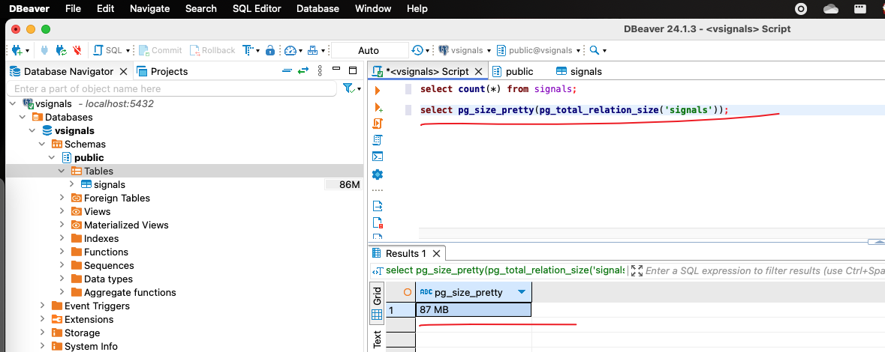

# spark against vehicle signals storage evaluation

just per personal needs do simple test agaist PG, InfluxDB and DynamoDB local, not for any other purposes.

## InfluxDB

git clone: https://github.com/jkehres/docker-compose-influxdb-grafana, and then run
`docker-compose up -d`, in my local env with the InfluxDB v2.7.6 docker image downloaded

after initializing the local InfluDB environment (refer to https://docs.influxdata.com/influxdb/v2/get-started/setup/), need edit the influxdb_test python file to set InfluxDB environment variables below:

> bucket = "v-signals"
>
> org = "jlr"
>
> token = "ygHbq1VKVxYHReX8ivjDj4ENejJe7edZetdaUkn5KYLQafeyL52Jeju_D3ih__IUd9251SOOdAL12M7DWRQRaw=="
>
> url = "http://localhost:8086"

and then run commands below:

> python3 -m venv .env
>
> source .env/bin/activate
>
> pip install influxdb_client

to run "pip install urllib3==1.26.6" if encoutering the problem below:

`/.env/lib/python3.9/site-packages/urllib3/__init__.py:35: NotOpenSSLWarning: urllib3 v2 only supports OpenSSL 1.1.1+, currently the 'ssl' module is compiled with 'LibreSSL 2.8.3'. See: https://github.com/urllib3/urllib3/issues/3020`

to query number of records written to the bucket, from bucket data explorer to run:

from(bucket: "v-signals")
  |> range(start: v.timeRangeStart, stop: v.timeRangeStop)
  |> group()
  |> count()

to view storage size, run `docker exec -it xxx_container_id bash` to enter into container and then
run `du -sh /var/lib/influxdb2/engine/data/` to view disk storage size

basically, 1 million records needs about 12M storage space

## PostgreSQL

to execute the command below to start the postgresql database:

`docker-compose -f docker-compose-postgresql.yml up -d`

use your preferred DB client to connect to the database which connectivity info in the docker-compose-postgresql.yml file.

basically, 1 million records needs about 87M storage space (insert 1 million into PG, seems pretty fast, much much faster than InfluxDB and DynamoDB local, in local enviroment it needs less than 5 minutes to finish insertion, but DynamoDB local and InfluxDB it requies more than 20 minutes)

## DynamoDB Local

refer to https://docs.aws.amazon.com/amazondynamodb/latest/developerguide/DynamoDBLocal.DownloadingAndRunning.html, to run docker compose by executing the command below:

`docker-compose -f docker-compose-dynamodb-local.yml up -d`

refer to https://docs.aws.amazon.com/amazondynamodb/latest/developerguide/workbench.settingup.html, set up workbench and create connection to loca instance.

execute the command below, to run python code to test data writing, please note that delete the table v if it exists already:

> python3 -m venv .env
>
> source .env/bin/activate
>
> pip install boto3

here is the execution results:

basically, 1 million records needs about 80M storage space
